# Windows2012

# Primeiro escolha a linguagem e o teclado:
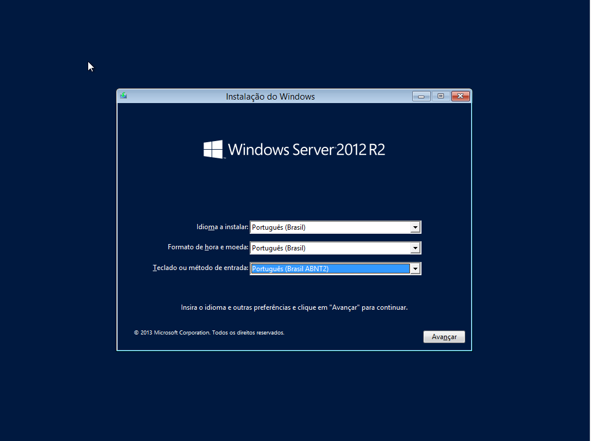
# Depois aperte em instalar:
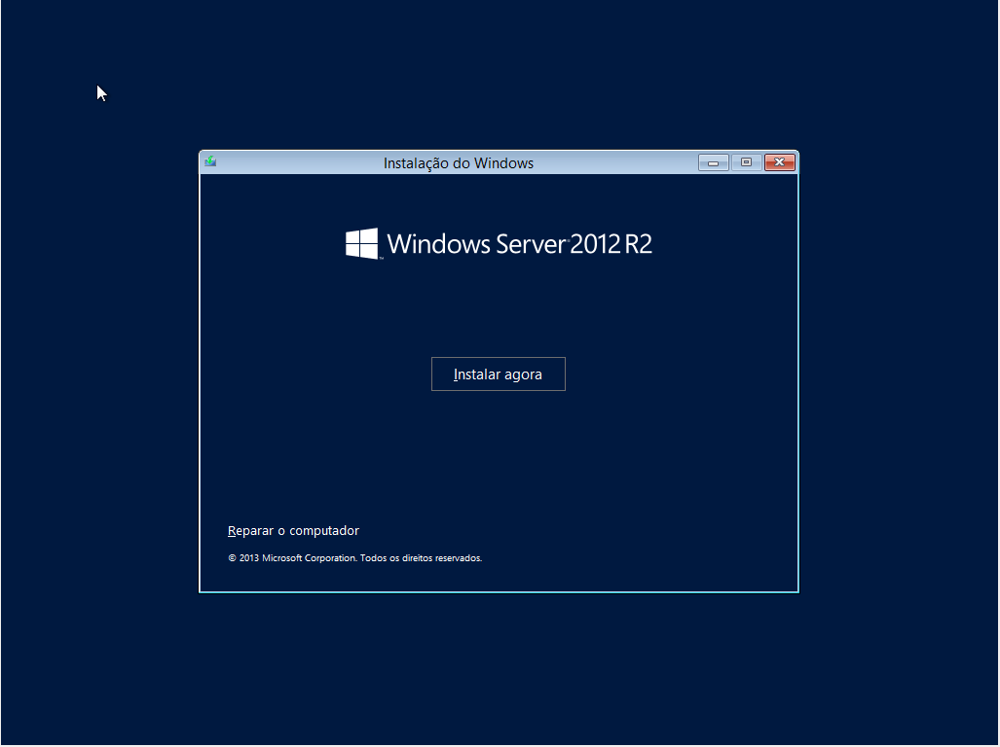
# Escolha o sistema operacional:

# Aceite os termos de licença:
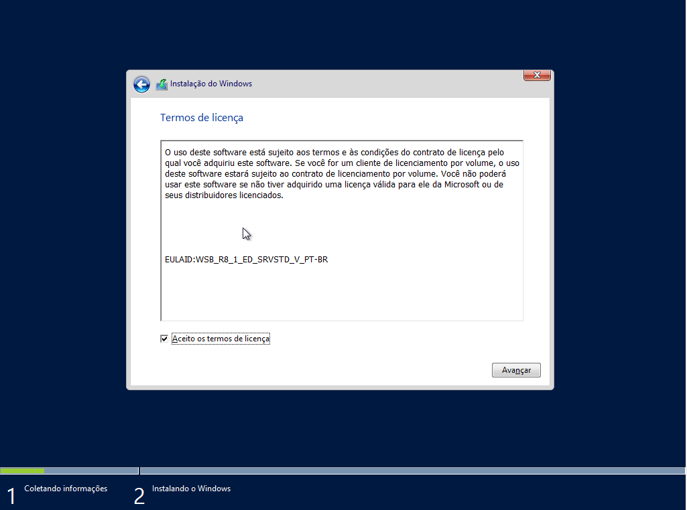
# Aperte em instalção personalizada:
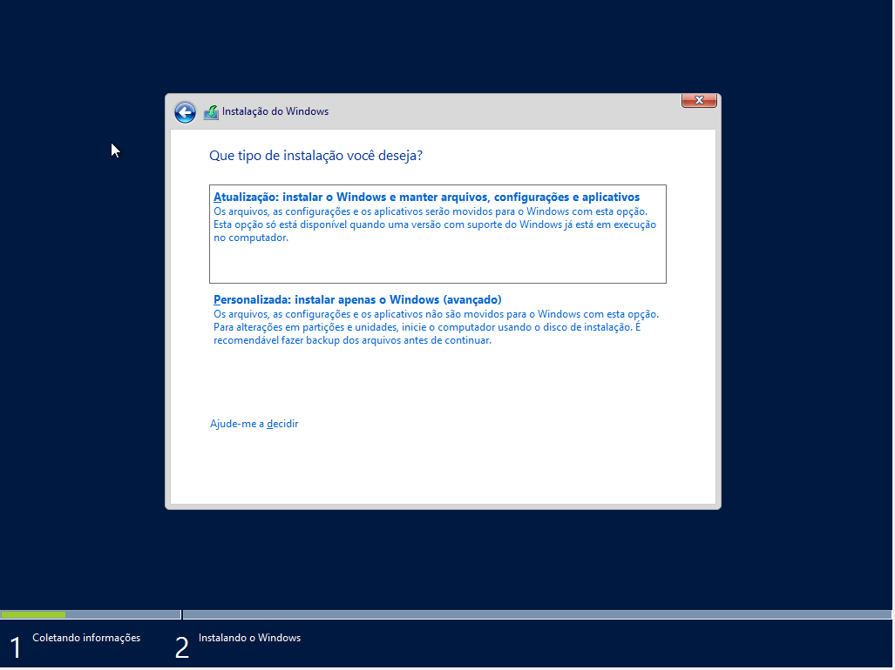
# Clique em avançar:
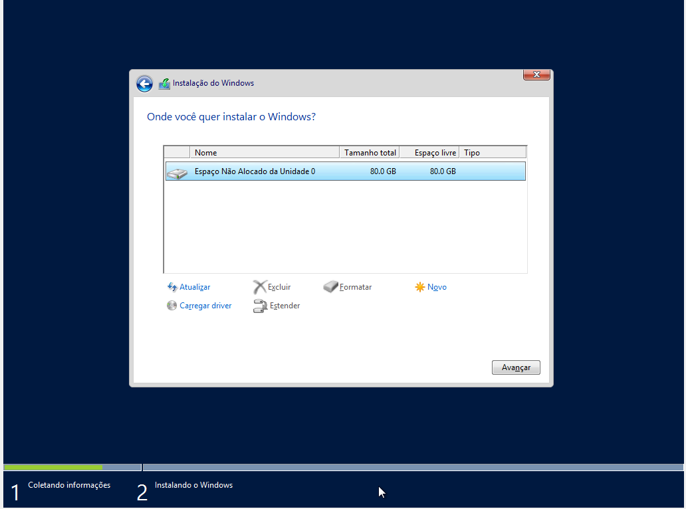
# Aperte em inciar:
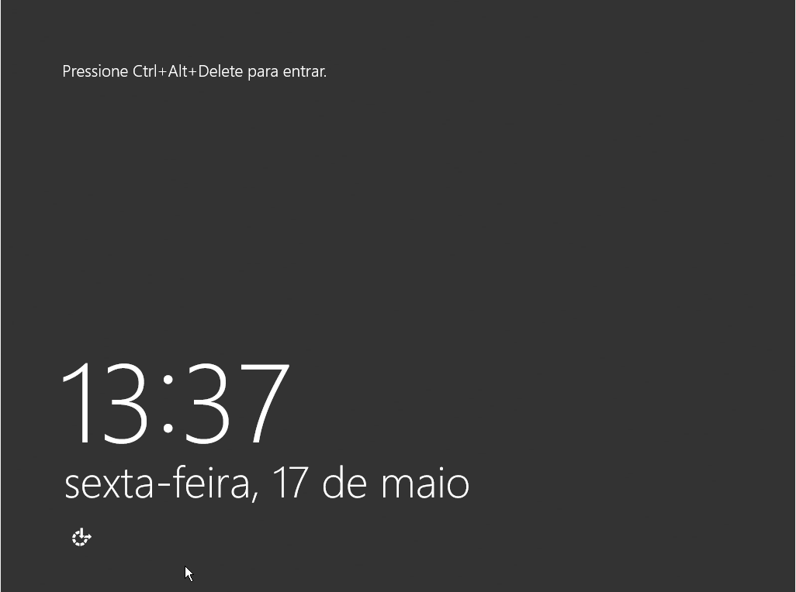
# Entre na pasta:
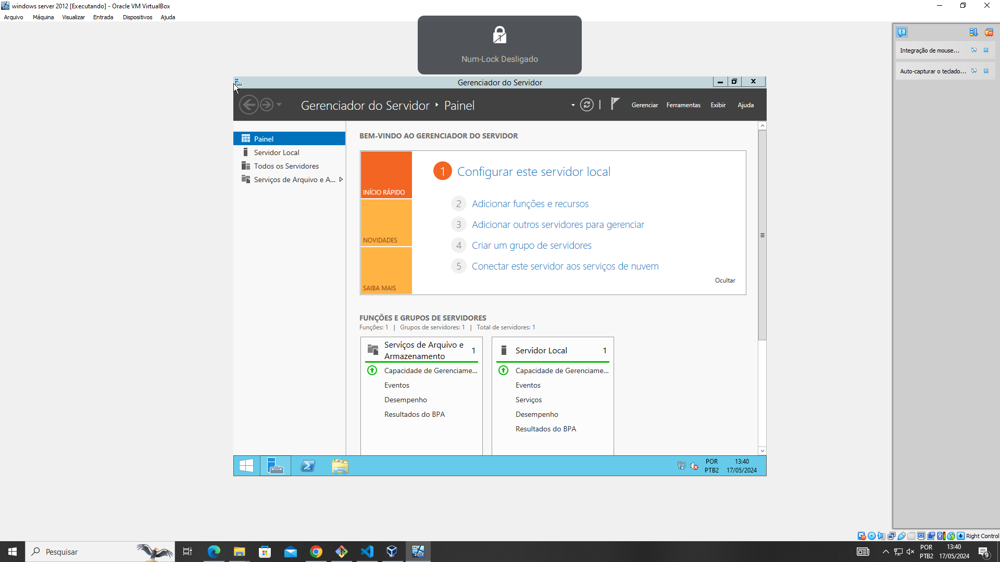
# Acessar unidade de cd do virtual box:
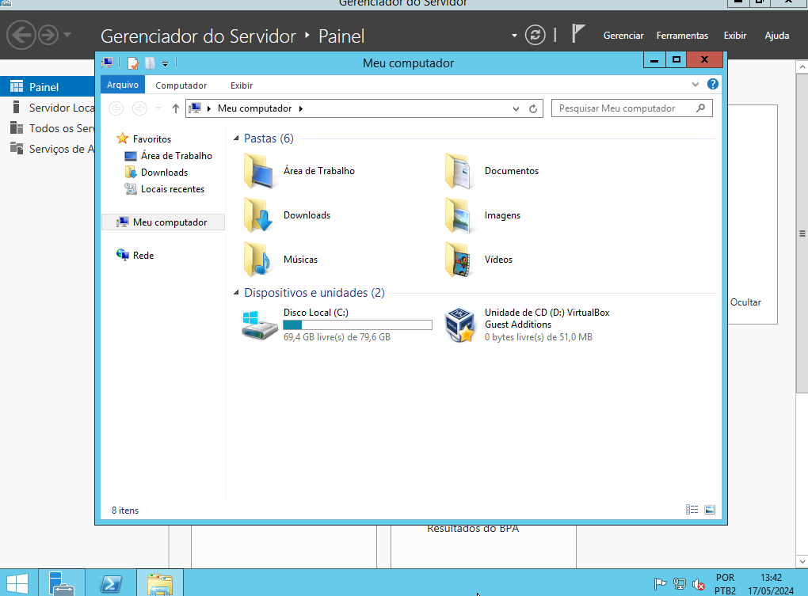
# Entre em VBoxWindowsAdditions:
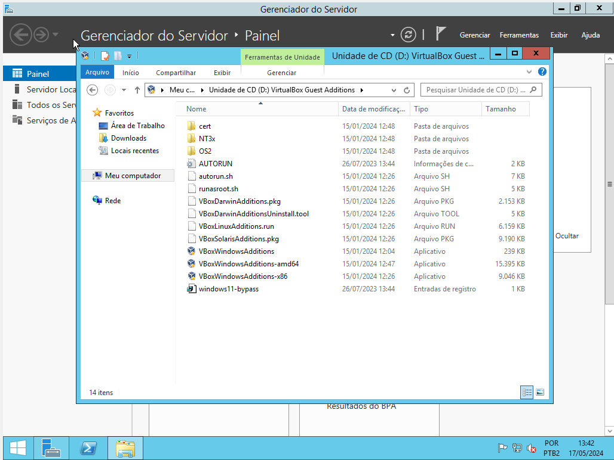
# Aperte em Next:
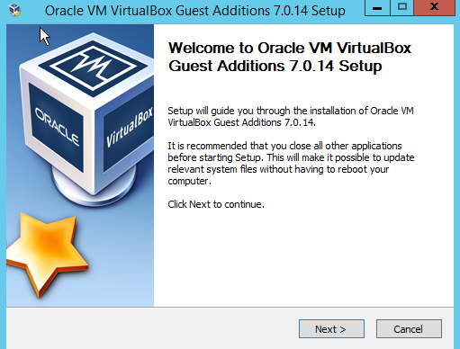
# Next novamente :
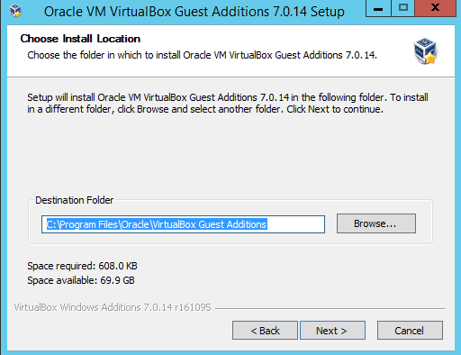
# Precione Install :
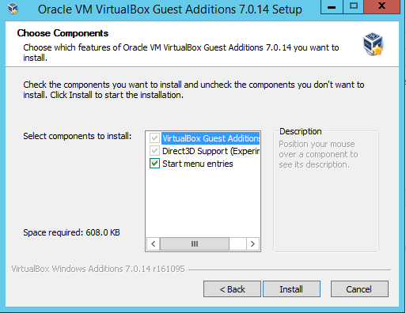
# Agora instalar :
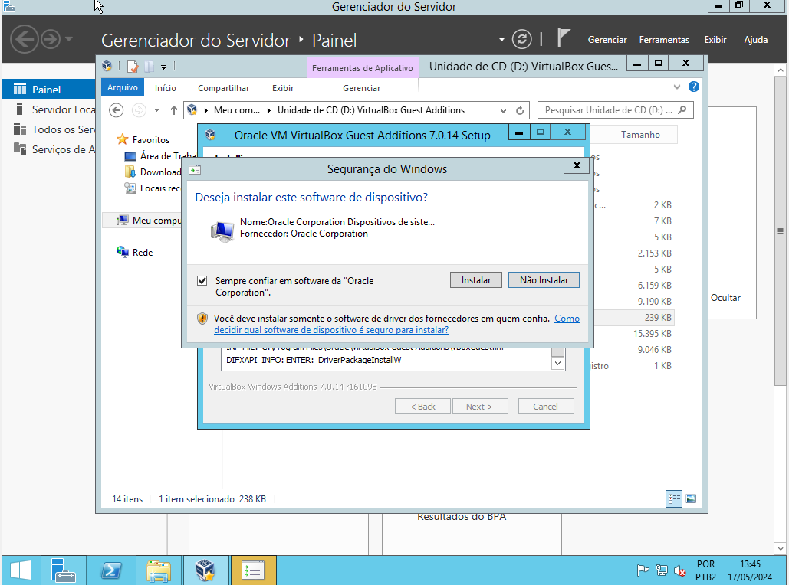
# Clique em Finish
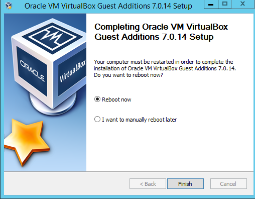
# Coloque sua senha :
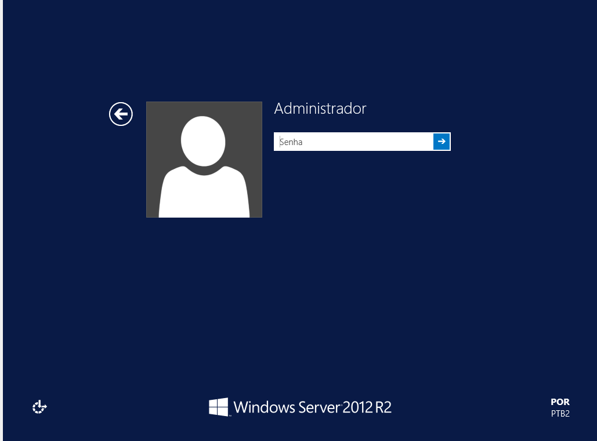
# Aperte o botão trocar :
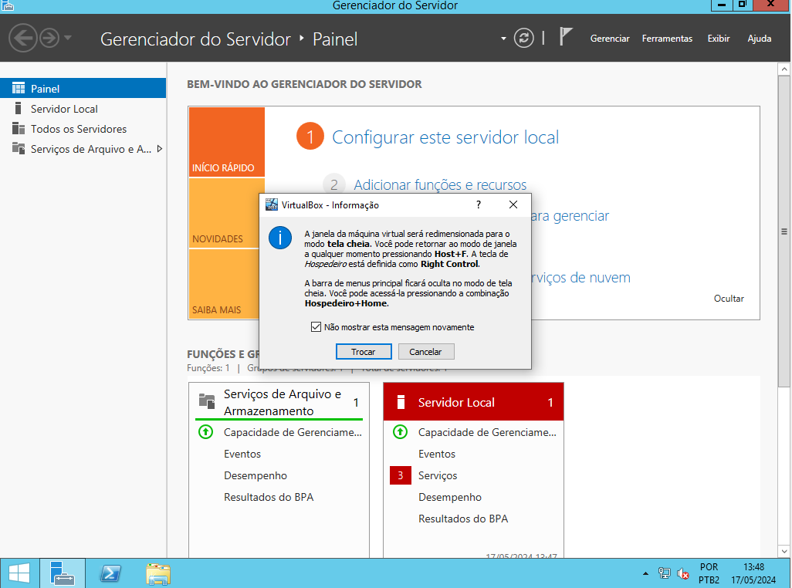

#             FIM !!!